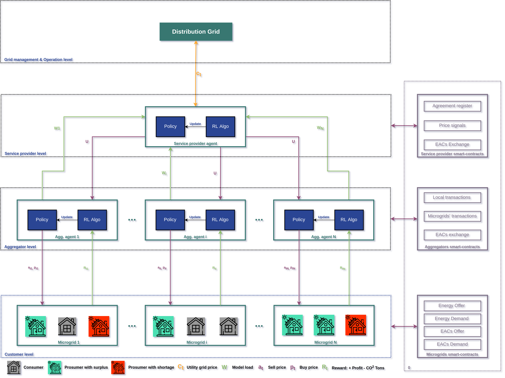
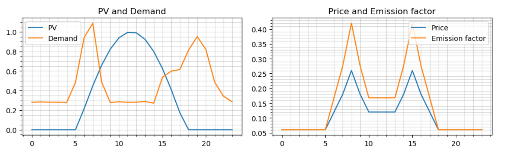

<div align="center">

#  Multi-Agent Hierarchical Transactive Grid - mbzuai-rl-research
<h3 align="center"> ML702 - Advanced Machine Learning </h3>
  

## Description
We present a multi-agent model trained using Reinforcement
Learning to accomplish the goal of defining the prices and dynamics that allow to sell or buy electricity between neighbohrs in a finely controlled manner.

## Research proposal
</div>
<p align="center">
   
</p>


## Installation
Run the code below to install the required libraries for this project:

```yaml
# clone project
git clone https://github.com/nicosquare/rl-energy-management.git
cd rl-energy-management

# create conda environment with necessary libraries
conda env create --name rl_energy --file requirements.yml
conda activate rl_energy

#create folders necessary for the demo
mkdir imgs 
mkdir models
```

In case if you want to use wandb, make sure to have in the config files the variable ```disable_logging: False``` and set up a file called ```.env``` with the following information: 

``` 
WANDB_KEY={key_from_https://wandb.ai/authorize} 
WANDB_PROJECT_NAME={project_name}
WANDB_ENTITY={entity}
```

Otherwise, if you don't want to use Wandb, setup in the config files ```disable_logging: True``` 


## Project Files Description
There are many files that are sources to be used in the future for the general pipeline demonstrated in the research proposal. For the matter of ML702 project we will focus in the following files: 

```src/notebooks/test-simple-env.ipynb```: This notebook contains all the types of RL agents tested so far. It's the file used for the demo. 

```src/rl```: This folder has all the algorithms to be used by the agents, for example we can see in the folder ```a2c``` (Actor-Critic) two files, ```c_mg_simple.py``` to learn using continuous variables and ```d_mg_simple.py``` learning with discrete variables. Same with the folder ```pg``` (Policy Gradient). 

```config```: This folder contains the different configuration files for the agents we are training for the micro-grid. 

```blockchain```: This folder has an example of Blockchain transactions planned to be incorporated in the future to the pipeline.

## Demo 
### Training PG and A2C 
The demo is available in the following notebook: ```src/notebooks/test-simple-env.ipynb```
This demo contains how the agent would work under different configurations and types of RL such as Policy Gradient (PG) and Actor-Critc (A2C). Make sure to run the notebook using the Conda enviroment of  ```rl_energy```.

## Data
For the observations, we generated the data accordingly to the different demand profiles (family, student housing, business). Example below for the the family demand: 
</div>
<p align="center">
   
</p>


## Packages
Check the ```requirements.yml``` for more information. 